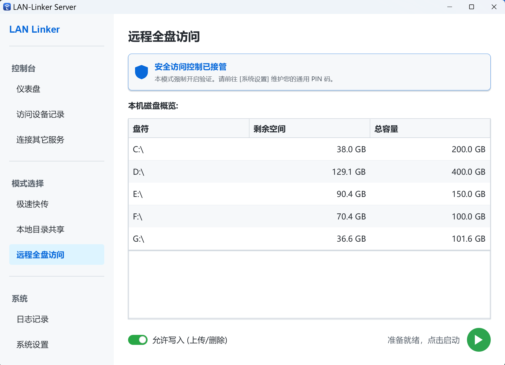
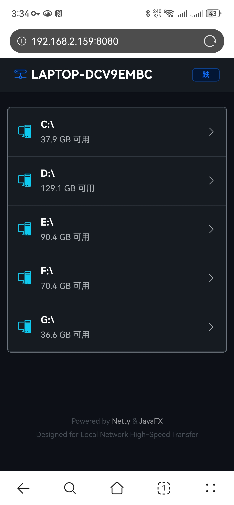

# LAN Linker

   

**LAN Linker** 是一款基于 JavaFX 和 Netty 开发的高性能局域网文件传输与管理工具。你的电脑将变为一个高性能服务器，任何处于同一网络下的设备（手机、平板或其他电脑）无需安装任何软件，仅凭浏览器即可与你进行高速的文件交换与信息同步。
> **注：** 不同账号的校园网属于一个大的局域网，也允许互通

---
## 快速开始

右侧网站可下载最新绿色版，也可在release里下载。已打包好exe和相关的jre运行环境，解压后双击运行即可使用。无需额外配置任何jdk环境

---
## 软件功能介绍

### 1. 服务器控制台 (Dashboard)
整个服务器的总控制台，整个界面分为两部分：
#### 1.1 状态监控与连接
*   **状态灯与文字**：显示服务器当前的运行模式（快传、本地共享或远程访问）。红色代表停止，绿色代表正在运行。
*   **网络信息卡片**：
    *   **未启动时**：进行网络环境预检。程序会自动抓取你的局域网 IP，并实时检测端口是否被占用。如果显示红色“端口被占用”，请前往设置修改。
    *   **启动后**：卡片变成连接方式指引。左侧自动生成 **二维码**，手机扫码即可访问；右侧显示完整的 **URL 链接**，支持点击“复制”按钮一键分享。
*   **刷新按钮**：如果切换了网络环境（例如从校园网切到手机热点），点击此按钮可重新获取 IP。

#### 1.2 实时流量看板 (MB/s)
*   **波形图**：展示最近 60 秒的网速波动。
    *   **🟢 绿线 (上传速度)**：代表其它设备发往主机的速度（如手机正在上传文件给电脑）。
    *   **🔵 蓝线 (下载速度)**：代表数据从主机发往其它设备的速度（如手机正在下载你的文件）
*   **数值显示**：在图表上方实时显示具体的千字节或兆字节速率（KB/s 或 MB/s）。

> 以下三种模式只能同时启用一种，对应界面右下角可启动、切换或关闭对应模式。
### 2. ⚡ 极速快传 (Quick Share)

最高效的“跨端剪贴板”和临时文件交换站，该模式可用于文本、截图、文件的快捷传输。这些临时数据会存在电脑本地文件夹，并会定时清理。具体路径和清理周期可从“设置”里查看并修改。

#### 2.1 三种上传方式
*   **直接发送**：在顶部输入框打字，点击 **[发送]** 或按 **[Ctrl + Enter]** 快捷键，可直接上传文本信息。
*   **拖拽上传**：从电脑文件管理器将一个或多个文件直接拖进 App 窗口，系统会自动完成上传。（不支持文件夹上传）
*   **智能粘贴 (Ctrl+V)**：
    *   粘贴**文本**：自动识别并发送消息。
    *   粘贴**文件**：自动识别路径并复制文件到传输区。
    *   粘贴**截图**：从剪贴板捕获的位图数据会自动转码为 `picture_时间戳.png` 上传。

#### 2.2 传输时间轴
*   **混合排列**：文本与文件按发送时间倒序排列，最新的在最上面。
*   **一键操作**：右侧提供 **[复制图标]**（仅限文本）和 **[删除图标]**。
*   **安全限制**：文本长度（默认32767）和文件大小（默认1024MB）有限制，可在设置中进行更改。

#### 2.3 网页端操作
* 网页客户端的上传方式和界面结构与服务端**完全相同**

### 3. 📂 本地目录共享 (Local Share) 

将电脑上的特定目录一键挂载到网页端。这里服务端仅作为一个开关控制，无法在这里上传文件，但网页客户端可以上传。

#### 3.1 浏览与共享的分离逻辑
*   **共享根目录 (蓝条)**：网页端能看到的“顶层文件夹”。点击右侧 **[📂]** 可在资源管理器打开，点击 **[设为当前目录]** 可将下方浏览的位置立即生效。
*   **正在浏览 (灰条)**：你可以在 App 内自由翻找文件，这**不会**影响网页端正在访问的内容。
*   **常用目录**：右侧下拉框会记忆你最近共享过的 5 个文件夹，方便一键回溯。
*   **文件列表**：支持 📁 文件夹和 📄 文件的视觉区分。双击文件夹可深入浏览。不支持直接打开文件。

#### 3.2 权限控制
*   **允许写入 (上传/删除)**：拨动底部的拉杆开关。
    *   **开启**：网页端可以上传文件到此目录，也可以删除文件。
    *   **关闭**：网页端变为“只读模式”，仅能浏览和下载。
#### 3.3 网页端操作
* 网页端会看到一个文件列表，可对共享的文件和文件夹进行访问、下载、上传、删除（若允许写入）。

### 4. 🛡️ 远程全盘访问 (Remote Disk)

本地目录共享的plus版本，允许网页端访问电脑里全部磁盘的全部文件。

*   **安全强校验**：本模式默认开启强制身份验证。如果未在设置中开启全局保护和配置PIN码，系统将**拒绝启动**。
*   **磁盘概览**：实时显示电脑所有磁盘分区的容量、剩余空间及使用百分比。
*   **权限控制**：与3.2类似，可设置是否允许写入。
*   **网页体验**：网页端会看到类似“我的电脑”的界面，支持全盘文件浏览。

### 5. 📱 访问设备记录 (Sessions) 

提供实时的连接监视功能。

*   **状态识别**：
    *   **🟢 已授权**：该用户已正确输入 PIN 码并获得了访问权。
    *   **⚪ 访客**：该设备仅处于连接状态，尚未通过验证（或当前无需验证）。
*   **设备细节**：显示对方的 **IP 地址**、**设备型号**（如 Android, iPhone）以及他自定义的**昵称**。
*   **上次活跃**：记录对方最后一次与你交互的时间。
*   **踢出按钮**：点击 **[踢出]**，该设备的授权将失效。如果开启了安全网关，对方刷新网页后必须重新输入密码。

### 📡 6. 连接其它服务 (Radar)

本模块利用 UDP 广播协议实现 P2P 发现。适用于两个电脑都安装LAN Linker的情况。

*   **雷达扫描**：点击 **[立即刷新]**，App 会向局域网广播信号。
*   **自动发现**：如果局域网其它设备也下载并开启了 LAN Linker 并允许被发现，他的设备会出现在列表中。
*   **一键跳转**：点击列表中的设备，将直接在你的默认浏览器中打开对方的共享网页。

### ⚙️ 7. 系统设置 (Settings)

*   **常规**：修改 **服务端口**（自动检测占用）、选择优先 IP（适配双网卡环境）、修改设备名称、是否启用托盘。
*   **安全**：开启 **全局保护** 后，所有模式均需 PIN 码；设置 **登录有效期** 可决定网页端多久需要重新登录；设置是否**开启广播**，若开启则会被其它LAN Linker扫描到（关闭可防止泄露ip）。
*   **传输**：设置 **单文件上传上限**（最高 2047MB）和**文本字数**（最多一百万）；自定义 **快传缓存路径**；管理 **自动清理周期**。
*   **外观**：一键切换 **深色/浅色模式**，调整 **界面缩放**（80% - 150%）。
*   **系统**：设置日志详细程度；查看配置文件、用户记录文件、日志文件目录；点击 **[恢复所有设置]** 会删除所有 `.properties` 文件，重启程序后回归默认状态。

### 📂 8. 日志记录 (Logs)

系统会自动重定向所有报错信息。
*   **[打开日志文件夹]**：直接查看按日期生成的 `.txt` 日志文件。
*   **[清空日志]**：清理内存中的实时滚动信息。
*   **Debug 模式**：在设置中开启后，日志会记录每一个 HTTP 请求包。

---
## 界面预览

|   **仪表盘 (Dashboard)**   | **  |
|:-----------------------:|:--------------------------------------:|
|  **极速快传(Quick share)**  | ** |
| **本地目录共享(Local share)** | *  |
| **远程全盘访问(Remote Disk)** | ** |
### 网页端（这里拿手机演示）
|  **极速快传**  |  |
|:----------:|:----------------------------------------:|
| **本地目录共享** |  |
| **远程全盘访问** |              |

---
## 技术栈

本项目使用了以下核心技术：

*   **GUI 框架**: JavaFX 21 + AtlantaFX (主题美化) + ControlsFX (高级组件)
*   **网络核心**: Netty 4.1 (高性能 NIO 服务器，手写 HTTP 协议解析)
*   **Web 前端**: Bootstrap 5.3 (响应式布局) + Vanilla JS (AJAX 无刷新上传)
*   **工具库**: ZXing (二维码生成)

---

## 开发构建
```bash
git clone https://github.com/vc6-1998/LAN-Linker.git
cd LAN-Linker
mvn clean package
# 构建产物位于 target/ 目录下
```

---

## 开发者信息

*   **作者**: `ME`
*   **学校**: Beijing Institute of Technology
*   **学号**: 112024xxxx
*   **课程**: Java 语言程序设计结课作业（金爷爷）

---

## 许可证

本项目采用 MIT 许可证，详情请参阅 [LICENSE](LICENSE) 文件。
