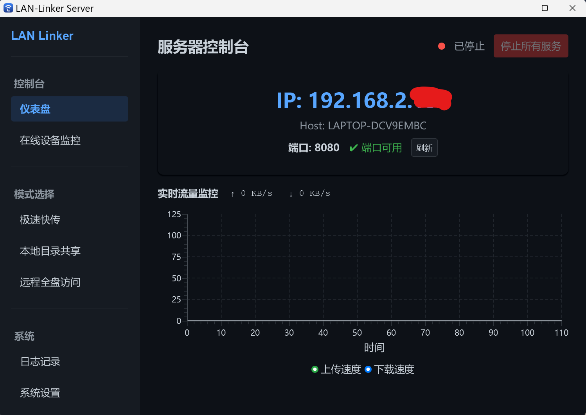
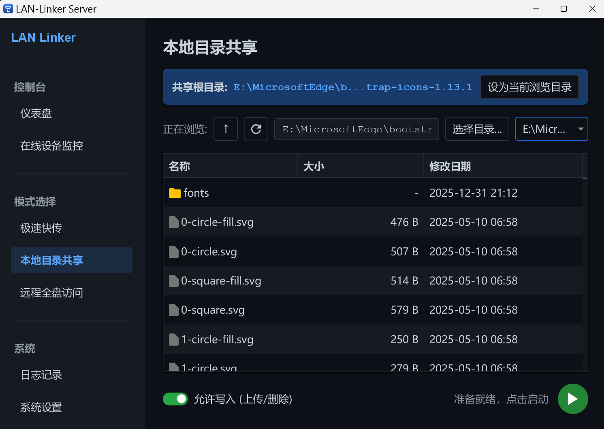
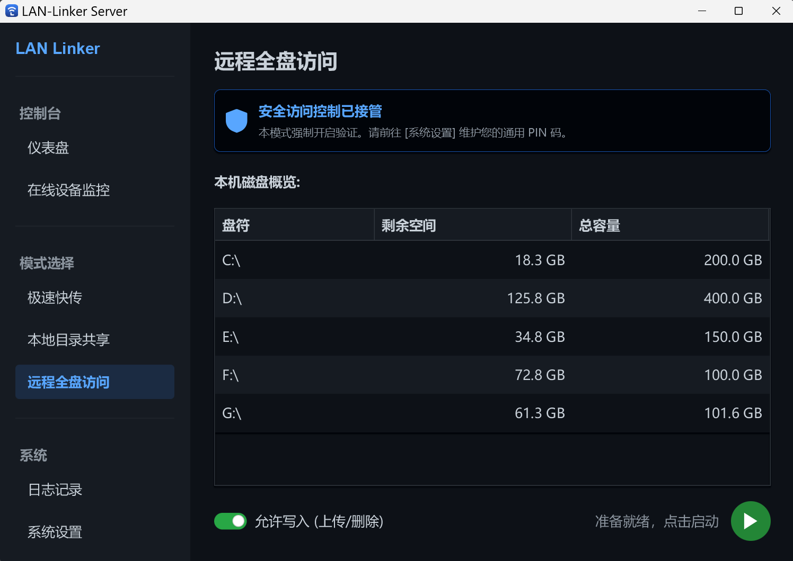
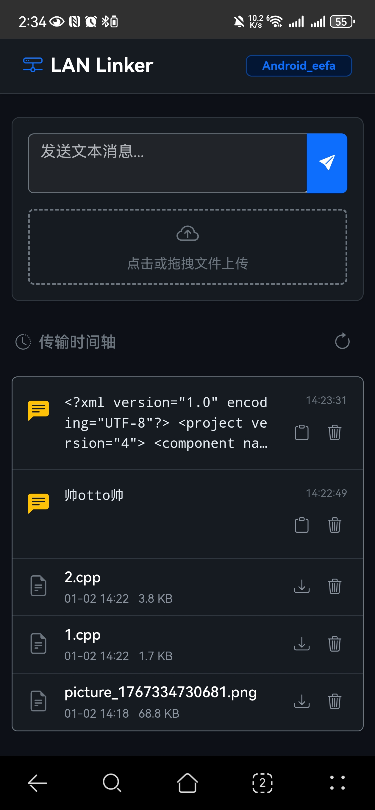
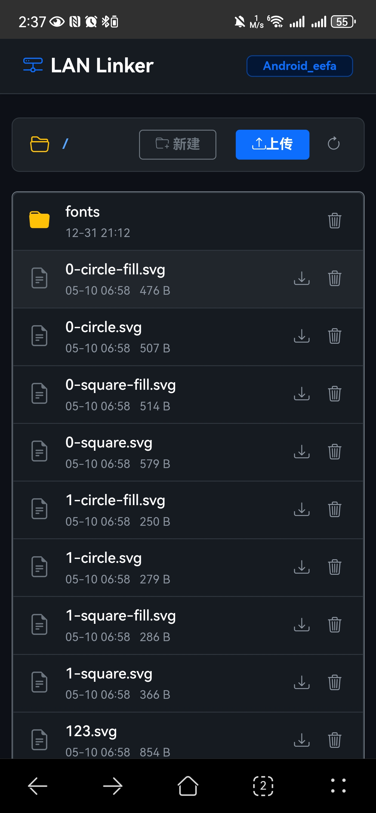
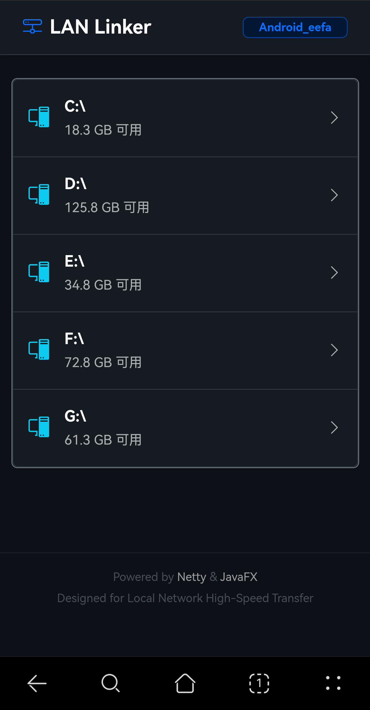

# LAN Linker

   

**LAN Linker** 是一款基于 JavaFX 和 Netty 开发的高性能局域网文件传输与管理工具。专为校园网、办公室等局域网环境设计，无需登录账号，即可实现跨设备的文件秒传、剪贴板同步和远程文件管理。

> **注：** 不同账号的校园网属于一个大的局域网，允许互通


---

### 核心功能

### 1. 极速快传 (Quick Share)
像微信文件传输助手一样简单，但基于局域网直连，速度飞快，且不用担心图片/视频压缩问题。
*   **跨端同步**：电脑端共享一个临时空间，允许双向传输文本和文件（客户端和网页端均可）。
*   **无感交互**：支持 `Ctrl+V` 粘贴文本、文件、屏幕截图，也支持拖拽上传。

### 2. 本地目录共享 (Local Share)
将电脑变为高性能文件服务器。
*   **一键共享**：可选择特定文件夹，在局域网内共享文件夹下内容，其它设备连接即可下载、上传。
*   **权限控制**：允许开关写入权限（包括上传、删除等操作），保护文件安全。
*   **断点续传**：基于 Netty 的高效 IO，支持大文件稳定传输。

### 3. 远程全盘访问 (Remote Disk)
*   **私有云体验**：可在其它设备上远程管理电脑所有磁盘下的内容（C/D/E盘），开启此模式必须设置PIN码。
*   **安全网关**：内置全局安全拦截器，防止未授权访问。

### 4. 可视化控制台
*   **实时监控**：动态波形图显示上传/下载速率。
*   **连接助手**：自动生成局域网 IP 二维码，手机扫码即连。
*   **设备管理**：实时查看在线设备列表。

---

## 界面预览

|   **仪表盘 (Dashboard)**   | ** |
|:-----------------------:|:------------------------------:|
|  **极速快传(Quick share)**  | ** |
| **本地目录共享(Local share)** | *  |
| **远程全盘访问(Remote Disk)** | ** |
### 网页端（这里拿手机演示）
|  **极速快传**  |  |
|:----------:|:-----------------------:|
| **本地目录共享** |  |
| **远程全盘访问** |  |

## 技术栈

本项目使用了以下核心技术：

*   **GUI 框架**: JavaFX 21 + AtlantaFX (主题美化) + ControlsFX (高级组件)
*   **网络核心**: Netty 4.1 (高性能 NIO 服务器，手写 HTTP 协议解析)
*   **Web 前端**: Bootstrap 5.3 (响应式布局) + Vanilla JS (AJAX 无刷新上传)
*   **工具库**: ZXing (二维码生成)

---

## 快速开始

### 环境要求
*   JDK 21 或更高版本
*   Windows 系统

### 下载方式
右侧release处可下载绿色版，已打包好exe和相关的jre运行环境，双击运行即可使用。无需配置任何jdk环境

## 开发构建
```bash
git clone https://github.com/vc6-1998/LAN-Linker.git
cd LAN-Linker
mvn clean package
# 构建产物位于 target/ 目录下
```

---

## 开发者信息

*   **作者**: `Me`
*   **学号**: 112024xxxx
*   **课程**: Java 语言程序设计结课作业（北理金旭亮）

---

## 许可证

本项目采用 MIT 许可证，详情请参阅 [LICENSE](LICENSE) 文件。
